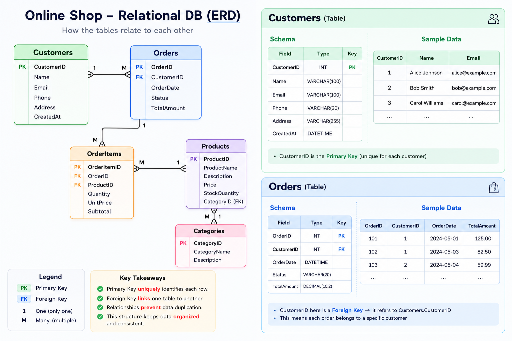

## UNDERSTANDING RELATIONAL DATABASE

\
***What is a Database itself?***

A database is simply an organised collection of data that is stored and can be managed, accessed and updated. 

A database is of two major types, one of which is the **Relational Database** and that's the main point of interest. 
##
So what then is a **Relational Database**?

\
A **Relational Database** is a type of database that stores data in tables - rows and columns - and uses the relationship between those tables to organize and retrieve information efficiently.             

It is important to note that the data stored in a Relational Database should have a pre-defined relationship between them. Data here is organized into tables with each row containing individual record and columns, containing attributes with values.

## Some Key Concepts of a Relational Database.

1. **Table**: A table is a collection of related data (e.g, Customers). And a **table** is typically made a rows and columns. 
2. **Row**: This is known as a **Record** and it represents an individual entry in an entity.
3. **Column** A column is otherwise called a **Field**.  It describes a specific attribute (e.g, Name, Email.) 
4. **Primary Key(PK)**: This is a unique identifier for each row (e.g, CustomerID)
5. **Foreign Key(FK)**: Is a column that references a primary key in another table.
6. **Entity**: 
7. **Index(ing)**: This helps the database find data faster. With an index, you can jump directly to the matching rows instead of reading it individually. Think of it as a filter option. 

## Benefits of Relational Database
1. **Data Integrity**: The database can enforce integrity by preventing invalid relationships, like an order referencing a customer that does not exist. 
2. **Security**: You can limit access to read, modify, and delete data even at the individual cell level. This type of access control makes relational databases very secure.
3. **Avoids Duplication**: Information is stored once and not repeated for every new entry. For exampple, you dom't have to re-enter a customer's information with every new order.
4. **Easy querying**: You can easily combine data from multiple tables. 
5. **Backup and recovery**: Most relational databases have import and export functionality, so you can quickly create data backups. 

## Some Common Relational Databases.
1. MySQL
2. PostgreSQL
3. MariaDB
4. Oracle Database
5. Amazon RDS
6. Amazon Aurora

\
